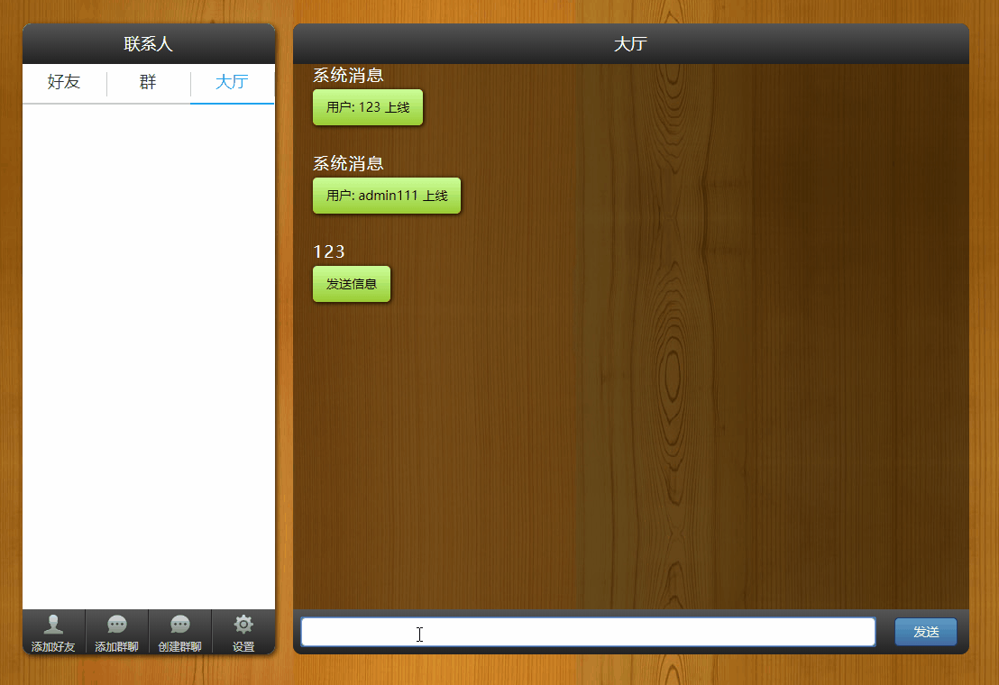
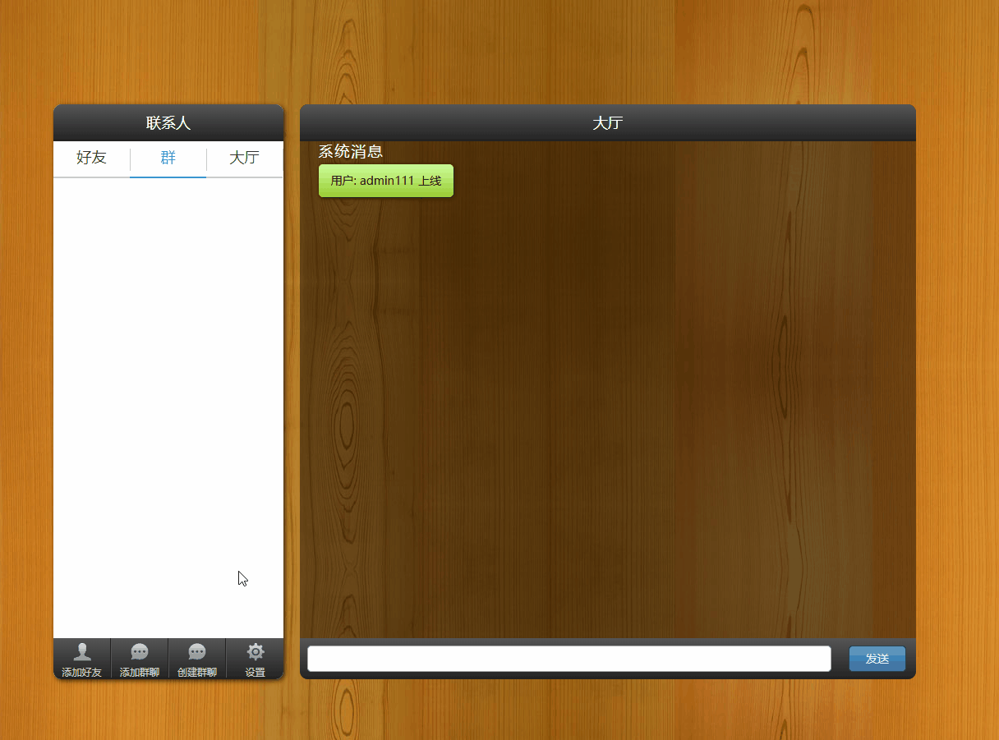

# 基于tornado和原生js前端的demo项目：link now 聊天室

项目展示地址：[http://129.204.67.23/](http://129.204.67.23/) （小水管服务器，首次打开会比较慢......）

demo登陆地址：[http://129.204.67.23/demo-login](http://129.204.67.23/demo-login)


项目说明

1. 项目使用前后端分离：前端使用原生的JavaScript；后端使用Tornado，信息管理服务器使用aiohttp
2. 使用MongoDB数据库进行数据的存储；使用Redis数据库提供消息处理任务队列
3. 使用Docker Compose方便的进行部署和开发；使用nginx进行内部的反向代理，分离静态文件请求和API请求
4. 后端使用Tornado作为web后台。根据任务类型，Web后台会将个人及群信息发送至MongoDB处理的服务器，进行持久化存储，而消息信息发送至Redis处理的服务器进行分发处理。Redis处理服务器会将信息依此发送会对应的Web服务器再发送回客户端
5. 可以使用nginx进行负载均衡设置，部署多台web后台服务器处理前端请求，和一台Redis处理的服务器统一处理消息请求，和一台MongoDB处理服务器统一处理个人及群信息请求
6. 前端使用WebSocket与后端进行双向通信，并使用JavaScript实现信息管理器，不同的Tab显示不同的信息


## 图片

1. 首页


2. 聊天室


### 部分功能展示

1. 发送消息



2. 添加好友


3. 创建群



4. 切换tab


## 运行说明

1. 先在本地部署docker compose
2. 运行
```
docker-compose up
```
